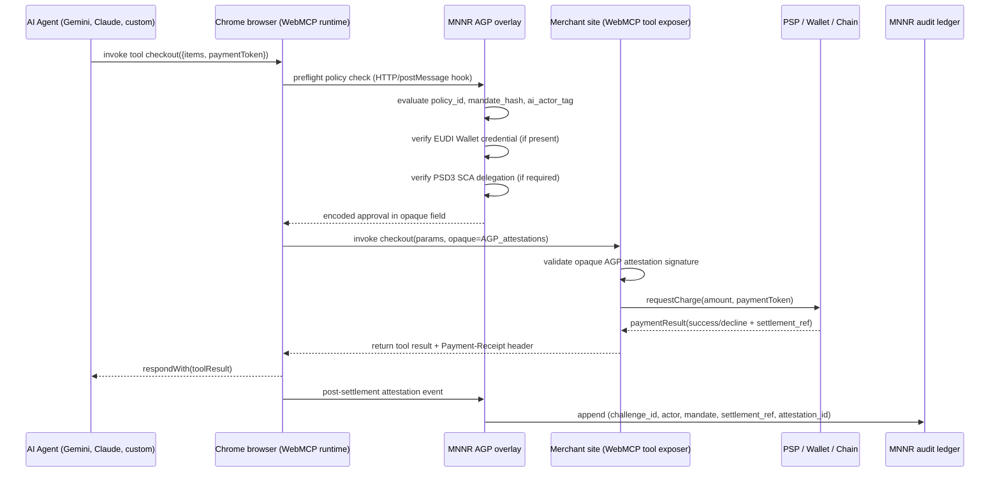

# AGP Integration: Chrome WebMCP

**Status:** Draft v1
**Last updated:** 2026-06-20 PT
**Origin trial scope:** Chrome 149 onward (origin trial began 2 June 2026)
**Sponsor:** Google + Microsoft via W3C Web Machine Learning Community Group

## What WebMCP is

WebMCP is a proposed open web standard that lets web pages expose JavaScript functions and HTML forms as machine-readable tools that browser-based agents can invoke. It is the front-end agent-discovery layer that complements Stripe Tempo MPP and Coinbase x402 on the payment-rail side.

## Why AGP integrates with WebMCP

Per public WebMCP spec section 6: WebMCP itself does not transmit identity attestations. Any EUDI Wallet / Verifiable Credential integration would have to be done by the overlay or custom tooling.

This is the deliberate design choice the AGP is built to fulfill. WebMCP defines the agent-to-site invocation contract; AGP defines the consent + attestation + audit layer wrapping that invocation.

## Integration sequence



## Implementation phases

### Phase 1 — Origin-trial registration (Q3 2026)

- Register MNNR origin-trial token at `chrome://origin-trials`
- Token domain-scoped, expires every ~6-8 weeks per Chrome release cycle
- Renew automatically via CI workflow
- Document partner-onboarding path for AGP-protected sites

### Phase 2 — Reference integration with one launch partner (Q3-Q4 2026)

- Wrap a single WebMCP tool call (for example, `checkout`) with AGP attestations
- Demonstrate end-to-end: agent invocation → AGP preflight → opaque field → site validation → settlement → audit log
- Publish as open reference implementation in `samples/webmcp-integration/`
- Candidate first partners: one of the 9 announced WebMCP origin-trial partners (Expedia, Booking.com, Shopify, Credit Karma, TurboTax, Redfin, Etsy, Instacart, Target) OR an EU bank partner already in MNNR discussions

### Phase 3 — Standards engagement (Q4 2026 onward)

- Participate in W3C Web ML CG WebMCP discussions
- Contribute identity-attestation + governance-overlay hooks to spec where appropriate
- Submit feedback on Chrome 150 / 151 stable releases
- Coordinate with Paul Kinlan (Chrome WebMCP lead) per cold-outreach kit

## Specification compatibility

| WebMCP version | AGP integration status |
|---|---|
| Chrome 149 origin trial (June 2026) | Phase 1 — registration + AGP preflight hook design |
| Chrome 150 stable (June 30, 2026) | Phase 2 — first reference integration |
| Chrome 151 stable (Aug 25, 2026) | Phase 3 — standards feedback + multi-partner deployment |
| W3C Working Draft (expected late 2026 / early 2027) | AGP overlay published as reference governance pattern |

## Compatibility with other AGP-supported rails

WebMCP is the front-end agent-discovery layer, not a settlement rail. It is therefore fully compatible with all other AGP-supported settlement rails:

- WebMCP tool call → site invokes Stripe Tempo MPP for stablecoin settlement (AGP attests on both legs)
- WebMCP tool call → site invokes x402 for stablecoin micropayment (AGP attests on the 402 response + retry)
- WebMCP tool call → site invokes AWS Bedrock AgentCore Payments (AGP attests on the agent identity passed through to AWS)
- WebMCP tool call → site invokes a traditional card processor (AGP attests on the agent identity + policy; settlement remains the merchant's existing flow)

This is why WebMCP is a Tier-1 strategic addition to AGP-supported rails: it widens the universe of agent-payment events AGP can govern, without competing with any existing settlement infrastructure.

## Compatibility with network agentic programs

WebMCP operates at the browser-to-site discovery layer. Visa Agentic Ready, Mastercard Agent Pay, and AP4M operate at the card-network rail layer. The three are orthogonal:

- An agent invokes a WebMCP `checkout` tool on a merchant site
- The merchant site authorizes the charge on Visa or Mastercard rails (potentially using the Visa Agentic Ready or Mastercard Agent Pay program if the issuing bank participates)
- AGP attests on the agent identity + consent + jurisdictional policy regardless of which rail clears the transaction

## CI/CD test browser recommendation — Chrome for Testing

The WebMCP origin trial spans Chrome 149 through approximately Chrome 156 (about 8 Chrome releases on the 6-8-week cycle). Auto-updating Chrome on developer or CI machines means MNNR's WebMCP integration tests can break BETWEEN consecutive test runs even with no code change. The canonical solution is **Chrome for Testing** — a Chrome flavor specifically built for browser automation, with the following properties:

- **No auto-update.** Pin specific Chrome versions in CI/CD so test results are reproducible across re-runs.
- **Versioned binaries.** Reference an exact Chrome version (for example, `chrome@149.0.7258.0`) in repo and lock it via lockfile.
- **ChromeDriver in lockstep.** Same release process aligns Chrome + ChromeDriver versions, eliminating compatibility errors.
- **Per-commit builds available since March 2025.** Bug bisection becomes precise — pinpoint exact Chrome change that broke an AGP integration test.
- **Distribution via npm.** `npx @puppeteer/browsers install chrome@stable` OR `npx @puppeteer/browsers install chrome@149.0.7258.0` for exact version pinning.

### MNNR CI/CD recommendation

| Pipeline stage | Browser | Justification |
|---|---|---|
| Local development | Chrome (regular) on team machines | Familiar dev environment; daily browsing + manual testing |
| CI integration tests (every PR) | Chrome for Testing pinned to current stable Chrome version | Reproducible per-PR test results |
| CI regression tests (nightly) | Chrome for Testing pinned to Chrome stable AND Chrome dev channel | Catch breaking changes one release cycle before stable lands |
| Customer demo environments | Chrome for Testing pinned to same version as production AGP integration spec | Demos won't break mid-presentation due to auto-update |
| Bug bisection | Chrome for Testing per-commit builds (March 2025+) | Precise root-cause analysis for Chrome-side regressions |

### Implementation

Add to repo CI config (for example, `.github/workflows/ci.yml`):

```yaml
- name: Install Chrome for Testing (pinned)
  run: |
    npx @puppeteer/browsers install chrome@stable
    npx @puppeteer/browsers install chromedriver@stable
    # OR for exact version pin:
    # npx @puppeteer/browsers install chrome@149.0.7258.0
    # npx @puppeteer/browsers install chromedriver@149.0.7258.0

- name: Run WebMCP integration tests
  run: pnpm test:webmcp:e2e
```

Add to `package.json`:
```json
"devDependencies": {
  "@puppeteer/browsers": "^2.0.0"
}
```

Version-pinning the Chrome stable channel is automatic; for exact-version pins, update the Chrome version string when intentionally bumping. Track Chrome for Testing availability at https://googlechromelabs.github.io/chrome-for-testing/.

### What Chrome for Testing is NOT

- Not for production end-user browsing (intentionally not listed on the regular Chrome download page)
- Not the right tool for marketing or positioning surfaces — pure engineering ops
- Not free of all auto-update risk — npm package can update; pin `@puppeteer/browsers` SDK version too

### Reference

- Chrome for Testing announcement: Mathias Bynens (Google Chrome DevRel), web.dev blog
- Chrome for Testing availability dashboard: https://googlechromelabs.github.io/chrome-for-testing/
- `@puppeteer/browsers` npm package: https://www.npmjs.com/package/@puppeteer/browsers
- Per-commit builds rollout (March 2025): https://groups.google.com/a/chromium.org/g/chromium-dev/c/ZqqNBLU96As

## Honest caveats

- The mermaid sequence diagram above uses a proposed AGP overlay attachment pattern, not a verified implementation. Engineering team needs to validate the `opaque` field carrying capacity (max bytes, encoding) before locking the integration design.
- The `requestUserInteraction()` SCA hook is the cleanest documented path for PSD3 compliance, but it relies on Chrome 149+ specifically. Fallback for non-Chrome browsers needs to be documented.
- Phase 2 partner target list (Expedia, Booking, etc.) is aspirational. Realistic first reference partner is more likely to be either (a) an EU bank already in MNNR discussions, or (b) a smaller WebMCP-friendly site MNNR has a direct relationship with.
- The W3C standardization timeline (late 2026 / early 2027 Working Draft) is the WebMCP report's estimate, NOT an official Google or W3C commitment.

## References

- Public WebMCP spec materials (Chrome dev blog, I/O 2026 keynote, MCP-B reference implementation, OpenTiny NEXT SDKs)
- WebMCP deep-research report: `investor_kit/deep_research_library_20260620/04_PRODUCT_TECHNICAL/20260620_WEBMCP_SPEC_OVERVIEW_CHROME_149_ORIGIN_TRIAL_v1.md`
- AGP spec rails matrix: `docs/agp-spec/rails.md`
- Visa Agentic Ready 21-bank participant roster: `agent/information_agents/mnnr_competitors/_TRACKED_TARGETS_ROSTER.md` (v2)
- Stablecoin settlement asset hierarchy: `agp_spec/stablecoin_settlement_asset_matrix_v1.md`
