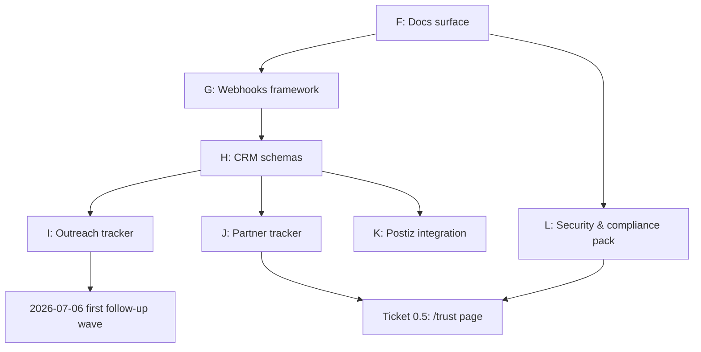

# MNNR — Investor & Partner-Grade Buildout Roadmap
**Anchor date:** 2026-07-01 (post-YOLO campaign — 70 sends fired, PR #61 merged)
**Owner:** TOHID NAEEM, MNNR LLC (WY domestic, EIN 33-3678186)
**Objective:** Advance MNNR from pre-launch to a state that survives due diligence from a Tier-1 VC (partner-grade) AND a Tier-A EU bank / PSP compliance team (partner-grade), before Article 50 applicability (2 August 2026).
**Standing constraint:** Claims Register discipline. No public claim about MNNR ships unless it has (a) evidence source, (b) evidence location filled with a real artifact, (c) reviewer sign-off, (d) expiry date. See `docs/compliance/CLAIMS_REGISTER.md`.

---

## Phase F — Documentation surface complete
**Why F is first:** Everything else (investor dd, partner integration, sales conversion) depends on docs. Empty pages kill conversion — see `/docs/api-reference` swagger flash bug fixed in `f742703`.

**Deliverables:**
- `/docs` index reworked as topic map, not link list
- `/docs/quick-start` — 10-minute happy-path, curl → dashboard → API key → first call
- `/docs/api-reference` — Swagger UI dark-themed (shipped in `f742703`) — verify all endpoints in `public/openapi.json` have example req/res
- `/docs/x402` — protocol conformance section + adapter reference
- `/docs/marketplace` — pricing tiers, revenue share model, distinct from `/docs/x402`
- `/docs/deployment` — Cloudflare Pages + Netlify (shipped in `d5b8b1c`) — add production checklist appendix
- `/docs/security` — Threat model summary + secure-by-default defaults
- `/docs/enterprise` — SSO, audit log export, DPA, VPAT
- `/docs/changelog` — auto-generated from git tags
- `/trust` — NEW top-level page. Aggregates status page, compliance certifications (as they land), subprocessor list, incident history. Ticket 0.5 per Claims Register.
- `/security.txt` — RFC 9116 (`/.well-known/security.txt` + contact)

**Acceptance criteria:**
- Every documented route in `public/openapi.json` has ≥1 working example
- Broken-link check across `/docs/*` passes (`lychee` or `linkinator` in CI)
- WCAG 2.1 AA contrast pass on all doc pages (Countdown skeleton already dark-safe)
- No mention of "Vercel" anywhere in `app/` or `components/` (verified — grep clean)

**Est effort:** 2-3 days.

---

## Phase G — Webhook framework (bidirectional)
**Why:** Partners (Adyen, Klarna, Stripe merchants, x402 clients) need to receive events and send them. Article 50 mandate-binding requires evented audit trail.

**Deliverables:**
- `packages/webhooks/receive/` — verified inbound handler with HMAC-SHA256 signature check, replay protection (5-min timestamp window + nonce set), retry semantics, DLQ
- `packages/webhooks/emit/` — outbound emitter with signed payloads (RSA + `x-mnnr-signature` header), exponential backoff (1s → 2s → 8s → 32s → 128s), automatic pause after 10 consecutive failures, resume-on-request
- `packages/webhooks/spec/` — event catalog (JSON Schema):
  - `mnnr.txn.initiated.v1` — agent transaction started
  - `mnnr.txn.settled.v1` — settlement confirmed
  - `mnnr.txn.disputed.v1` — dispute opened
  - `mnnr.actor.disclosed.v1` — Article 50 self-ID emitted
  - `mnnr.mandate.bound.v1` — mandate scope cryptographically bound
  - `mnnr.mandate.exceeded.v1` — mandate violation attempted
  - `mnnr.audit.exported.v1` — audit trail packet delivered
- `app/dashboard/webhooks/` — UI for endpoint management: URL, secret rotation, event subscriptions, delivery log, replay button
- Stripe webhook handler already exists — audit + confirm signature check + idempotency-key handling

**Acceptance criteria:**
- Postman collection with every event type + valid + invalid signature scenarios
- Load test: 1000 concurrent webhook deliveries, p99 < 300ms
- Signed payload independently verifiable by partners without SDK

**Est effort:** 3-4 days.

---

## Phase H — CRM (Contacts / Companies / Deals)
**Why:** OUTREACH_LOG.md is a flat markdown table. Cannot scale past 100 rows. Every real fintech buyer runs a CRM. Investors will ask "show me your pipeline" and want structure.

**Deliverables (Supabase tables):**
- `contacts` — id, email (unique), first_name, last_name, title, linkedin_url, apollo_person_id, org_id, timezone, created_at, updated_at, source ('apollo' | 'inbound' | 'referral' | 'manual'), verified_email boolean, last_verified_at
- `organizations` — id, name (unique), domain, industry, employee_count_bucket, revenue_bucket, hq_country, apollo_org_id
- `interactions` — id, contact_id, org_id, channel ('email' | 'linkedin' | 'call' | 'meeting' | 'other'), direction ('outbound' | 'inbound'), subject, body_summary, resend_id (nullable), sent_at, response_at (nullable), sentiment_score (nullable)
- `deals` — id, org_id, primary_contact_id, stage ('cold' | 'reached' | 'replied' | 'meeting_scheduled' | 'demo_done' | 'proposal_sent' | 'negotiation' | 'closed_won' | 'closed_lost' | 'nurture'), pilot_type ('a50_emergency_retrofit' | 'design_partner_pilot' | 'msa' | 'other'), amount_eur, close_date_estimate, notes, created_at, last_activity_at
- Row-Level Security policies (owner-only)
- Backfill script: parse OUTREACH_LOG.md → seed `contacts` + `interactions` for the 70 sends

**Acceptance criteria:**
- Dashboard `/dashboard/crm` renders pipeline Kanban (stages as columns)
- Search: type "Adyen" → returns Karan Katyal + Rahul Hampole + Casey Garretson + Nicholas Andrial
- Every outbound send in OUTREACH_LOG.md now a row in `interactions`

**Est effort:** 3-4 days.

---

## Phase I — Outreach tracker
**Why:** OUTREACH_LOG.md → structured DB → follow-up automation → response attribution.

**Deliverables:**
- Extends Phase H `interactions` table with delivery tracking columns
- Follow-up cadence engine: 2026-07-06 (first touch, 3 biz days), 2026-07-10 (second touch, 7 biz days), 2026-07-17 (angle-switch, 14 biz days)
- Reply detection: cron polls `siliconhillspr@` inbox via IMAP or Gmail API, matches replies to `interactions` by `resend_id` message-id chain, updates `response_at` + `sentiment_score`
- Bounce management: on Resend delivery event `bounced`, mark `contacts.verified_email = false`, suppress future sends
- `/dashboard/outreach` view: cohort delivery rate, reply rate, meeting rate, per-org drill-down
- Follow-up drafting: use existing template patterns from wave 1-8, personalize by role + `interactions` history

**Acceptance criteria:**
- 2026-07-06 follow-up wave fires automatically to unresponded W1-W3 recipients (61 candidates) with per-recipient customization
- Reply parked in `interactions.response_at` within 5 min of receipt
- Bounce ↔ contact.verified_email sync within 30s

**Est effort:** 2-3 days after H.

---

## Phase J — Partner tracker
**Why:** Outreach converts into partnerships. Need LOI → MSA → DPA → SLA lifecycle.

**Deliverables (Supabase tables):**
- `partnerships` — id, org_id, stage ('prospect' | 'discussion' | 'loi_negotiation' | 'loi_signed' | 'msa_negotiation' | 'msa_signed' | 'live' | 'sunset'), partnership_type ('acquirer' | 'issuer' | 'psp' | 'card_network' | 'bank' | 'fintech_platform' | 'other'), primary_contact_id, exec_sponsor_contact_id, target_go_live_date, actual_go_live_date, mrr_eur, notes
- `partnership_docs` — id, partnership_id, doc_type ('loi' | 'msa' | 'dpa' | 'sla' | 'aup' | 'sow' | 'insurance_cert'), file_url (Cloudflare R2 or Supabase Storage), status ('draft' | 'in_review' | 'signed' | 'expired'), signed_at, expires_at, counterparty_signatory_contact_id
- `partnership_milestones` — id, partnership_id, milestone ('first_intro' | 'technical_call_done' | 'security_questionnaire_returned' | 'sandbox_access_granted' | 'first_test_txn' | 'pilot_started' | 'live_traffic'), reached_at
- `/dashboard/partners` view: partnership funnel + upcoming renewals + expiring docs
- Automated reminders: doc expires in 90/30/7 days → email siliconhillspr@

**Acceptance criteria:**
- Every prospect from OUTREACH_LOG that has responded has a `partnerships` row
- Any doc expiring in <30 days surfaces on the dashboard with a red flag
- Public `/trust` page shows partnership count in each stage bucket (not names, just counts) — reinforces Claims Register discipline

**Est effort:** 2-3 days after H + I.

---

## Phase K — Postiz integration
**Why:** Social presence for MNNR is currently zero. Postiz already on stack (per `postiz:postiz` skill). Every partnership + design-partner announcement should cross-post to LinkedIn / X / Bluesky / Nostr in one action.

**Deliverables:**
- Postiz API key configured in `.env` (Postiz self-hosted or Postiz Cloud)
- `packages/social/postiz-client/` — thin TypeScript client wrapping Postiz REST API (create post, schedule, list drafts, get analytics)
- `/dashboard/social/` — draft, schedule, cross-post editor with per-platform character-limit preview
- CRM event → Postiz draft trigger: when `deals.stage` transitions to `closed_won`, a draft post is auto-generated (redacted, per Claims Register) for review
- Content calendar view: weekly grid of scheduled posts across channels

**Acceptance criteria:**
- One post → LinkedIn Personal + LinkedIn Company + X + Bluesky + Nostr in a single action
- Character-limit preview accurate per channel
- Analytics roll-up (impressions, engagement) visible in `/dashboard/social/analytics` within 24h of publish

**Est effort:** 2 days after H.

---

## Phase L — Security & compliance pack (investor-and-partner-grade)
**Why:** Every partner will send a security questionnaire (SIG Lite, CAIQ, Vendor Security Questionnaire). Every VC will ask about SOC 2 progress. This pack unblocks both.

**Deliverables:**
- `docs/security/threat-model.md` — STRIDE analysis on the current stack
- `docs/security/data-flow-diagram.md` — Mermaid diagram: user → Cloudflare → Next.js → Supabase → Stripe/Resend/Apollo
- `docs/security/subprocessor-list.md` — Cloudflare, Netlify, Supabase, Stripe, Resend, Apollo, Clerk, Sentry (each with purpose, data class, jurisdiction, DPA link)
- `docs/security/incident-response.md` — 4-tier severity playbook + on-call escalation (Tohid solo for now, doc who inherits when team grows)
- `docs/security/vulnerability-disclosure.md` — public policy, secure inbox address, 90-day disclosure timeline
- `.well-known/security.txt` — RFC 9116 compliant
- `docs/security/soc2-readiness-tracker.md` — control matrix (CC-1 through CC-9), current state, remediation owner, target date
- `docs/security/iso27001-mapping.md` — controls to existing operational practice
- `docs/security/pci-dss-scope-statement.md` — cardholder data flow attestation (mostly outsourced to Stripe = descoped)
- Dependency vulnerability program: `scripts/audit-deps.sh` runs `npm audit --production --json` weekly, opens issues for critical + high. Address the current 104 dependabot flags (1 crit / 43 high / 48 mod / 12 low)
- CSP nonce audit — verify middleware nonce-generation live in prod
- CI: gitleaks + trivy + semgrep on every PR
- SBOM: continuous — Dependabot Alerts (already on) + `syft` in CI producing SPDX output
- Post-quantum crypto: verify `/crypto` endpoint claims (ML-KEM-768 / ML-DSA-65) are backed by real key material, not stubs

**Acceptance criteria:**
- SIG Lite completeable end-to-end in <2h from templates
- SOC 2 CC-1 through CC-9 evidence path documented (auditor won't need to ask)
- All 1-crit + 43-high dependabot alerts resolved or explicitly triaged with justification
- `security.txt` responds 200 at `https://mnnr.app/.well-known/security.txt`

**Est effort:** 5-7 days (parallelizable with F-K).

---

## Dependency graph

## Sequenced execution windows

| Window | Focus | Deliverables closed |
|--------|-------|---------------------|
| 2026-07-01 – 07-05 | Phase F + L parallel | Docs + security pack drafts, weekly deep-cadence day |
| 2026-07-06 | Follow-up wave 1 fires | Uses OUTREACH_LOG static; Phase I not needed yet |
| 2026-07-06 – 07-10 | Phase G | Webhook framework end-to-end |
| 2026-07-10 | Follow-up wave 2 fires | Uses OUTREACH_LOG static |
| 2026-07-10 – 07-14 | Phase H | CRM schema + backfill + dashboard |
| 2026-07-14 – 07-17 | Phase I + K parallel | Outreach automation + Postiz |
| 2026-07-17 | Follow-up wave 3 fires via new automation | Live via Phase I |
| 2026-07-17 – 07-21 | Phase J | Partner tracker |
| 2026-07-21 – 07-28 | Buffer + polish | Investor materials, deck, data room |
| 2026-08-02 | Article 50 applicability | All above live, /trust public |

## What's already in flight (do not re-do)

- PR #61 (chore/p0-remediation-20260701-yolo-v2) — 7 commits: Claims Register + X-Robots-Tag + Countdown + CodeQL bot fix + Vercel-removal (config) + api-reference dark theme + Vercel scrub (site copy)
- Netlify preview deploying from PR #61
- Cold outreach 70 sends fired 2026-07-01 (documented in `docs/outreach/OUTREACH_LOG.md`, gitignored)
- Abacus Prompt B (Reconciliation Event Schema) — in flight per earlier context

## Non-goals for this roadmap

- Rebuilding the payment rails (out of scope — MNNR is the governance layer above whichever rail wins)
- Custody / stablecoin / L2 chains (deliberately not in the pitch)
- Mobile SDK (post-CE-mark, Q3 2026 at earliest)
- Full multi-tenant admin UI (single-tenant enough for pre-launch)

## Handoff points

- Abacus.AI ChatLLM — production of schema files, ticket bodies, doc drafts (grinds in parallel)
- Cursor / Claude Code — sandbox execution of scaffolds
- Tohid — architectural greenlights, factual review of positioning, contract-doc drafting, contract-doc counter-signing

## Update discipline

Update this file at the end of each phase. Not a wish list — a running control artifact. If a phase gets deferred, mark it. If a new phase gets added, insert it and re-graph.
